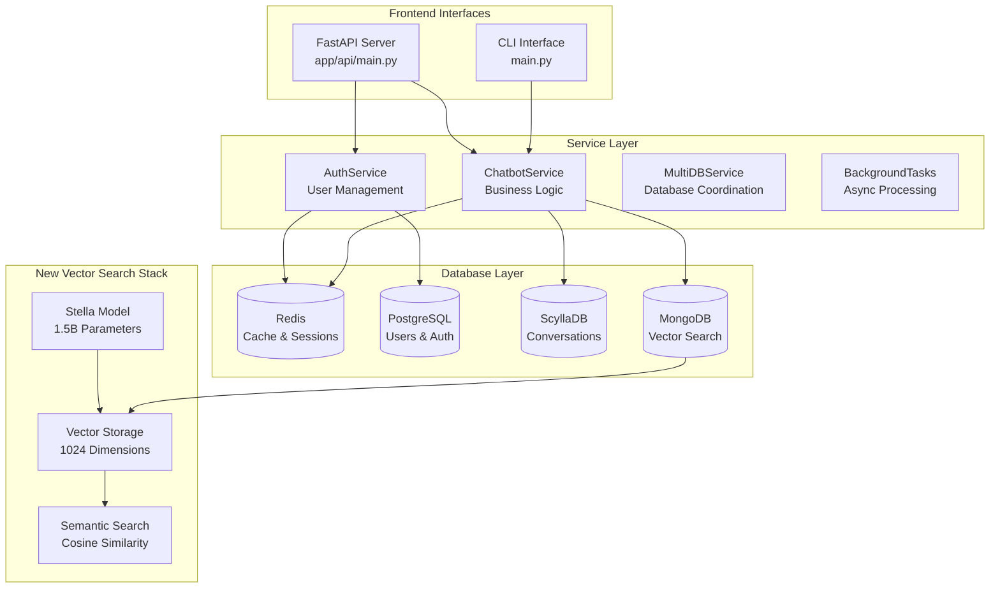
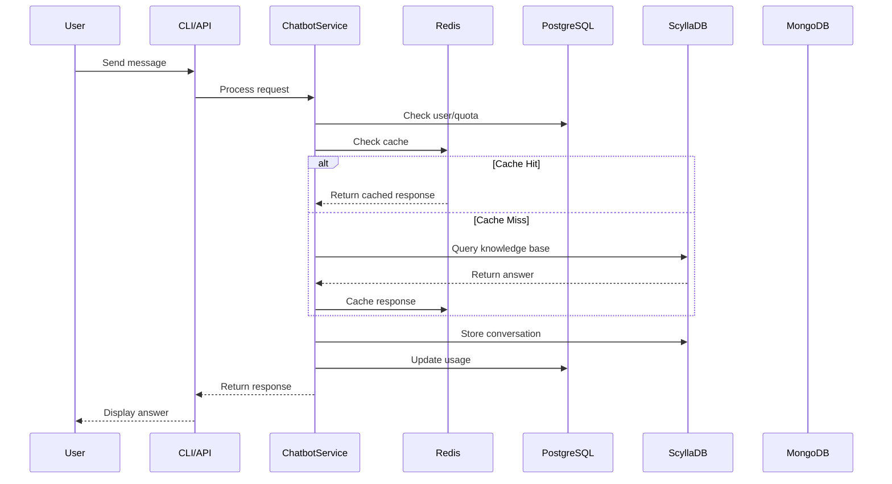
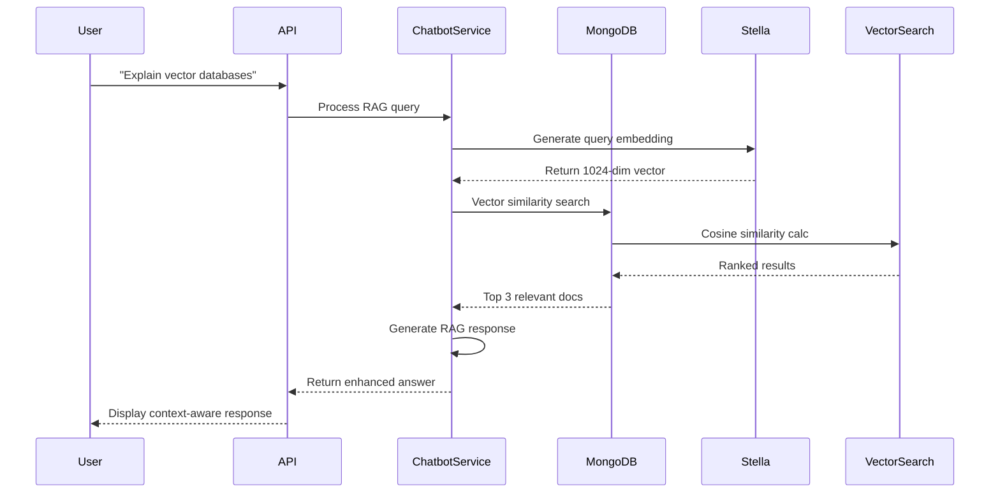

# 🏗️ MultiDB Project - Complete Architecture Breakdown

## 📊 **Current System Overview**



## 🗂️ **Module-by-Module Breakdown**

### **1. Configuration Layer** (`app/config.py`)

```python
@dataclass
class ApplicationConfig:
    scylla: ScyllaConfig      # ScyllaDB cluster config
    redis: RedisConfig        # Cache and session config  
    postgresql: PostgreSQLConfig  # User auth and billing
    mongo: MongoConfig        # NEW: Vector search config
```

**What it does:**
- ✅ **Unified configuration** for all 4 databases
- ✅ **Environment variable** integration
- ✅ **Feature flags** (enable/disable databases)
- ✅ **Connection pooling** settings for each DB

**Key Features:**
- MongoDB Atlas URI support for production
- Connection timeout and retry configurations
- Database-specific collection naming

---

### **2. Database Connection Layer** (`app/database/`)

#### **A. MongoDB Manager** (`mongo_connection.py`)
```python
class MongoDBManager:
    def initialize()           # Setup connection config
    def connect()             # Async connection to MongoDB
    def get_collection(name)  # Access specific collections
    def health_check()        # Connection health status
    def ensure_indexes()      # Create optimized indexes
```

**What it provides:**
- ✅ **Async connection management** using Motor
- ✅ **Collection access helpers** for embeddings, documents, conversations
- ✅ **Index creation** for performance optimization
- ✅ **Health monitoring** with detailed diagnostics
- ✅ **Error handling** with graceful degradation

**Collections configured:**
- `embeddings` → Vector storage with Stella embeddings
- `documents` → Source document storage (Phase 1 ready)
- `conversations` → Enhanced chat history (optional)
- `knowledge_base` → Enhanced Q&A storage (optional)

#### **B. Redis Manager** (`redis_connection.py`) - Existing
```python
class RedisManager:
    # Cache management for responses
    # Session storage for user state
    # Analytics counters and metrics
    # Notification queues for background tasks
```

#### **C. PostgreSQL Manager** (`postgres_connection.py`) - Existing
```python
class PostgreSQLManager:
    # User authentication and registration
    # Subscription plans and billing
    # Usage tracking and quotas
    # Audit logs for compliance
```

#### **D. ScyllaDB Connection** (`scylla_connection.py`) - Existing
```python
class ScyllaDBConnection:
    # Conversation history storage
    # Knowledge base for Q&A
    # User feedback and ratings
```

---

### **3. Service Layer** (`app/services/`)

#### **A. ChatbotService** (`chatbot_service.py`) - Enhanced Ready
```python
class ChatbotService:
    # Existing functionality:
    def process_message()           # Handle user queries
    def create_session()           # Manage chat sessions
    def get_session_summary()      # Analytics and stats
    
    # Ready for Phase 1 integration:
    async def store_document_for_rag()     # Store docs in MongoDB
    async def store_embeddings()           # Store vectors in MongoDB  
    async def vector_search()              # Semantic search
    async def enhanced_rag_response()      # RAG-powered responses
```

#### **B. AuthService** (`auth_service.py`) - Existing
```python
class AuthService:
    async def authenticate_user()    # JWT token validation
    async def create_user()          # User registration
    async def get_user_by_id()       # User lookup
    def create_access_token()        # JWT generation
```

---

### **4. Vector Search System** (NEW - Proven Working)

#### **A. Stella Embedding Model**
```python
class StellaVectorSearchTester:
    model_name = "infgrad/stella_en_1.5B_v5"
    embedding_dimension = 1024
    
    def initialize_embedding_model()  # Load 1.5B parameter model
    def generate_embeddings()         # Text → 1024-dim vectors
    def cosine_similarity()           # Vector similarity calc
```

**Capabilities proven:**
- ✅ **High-quality embeddings** (1.5B parameters)
- ✅ **1024-dimensional vectors** for high precision
- ✅ **Semantic understanding** of technical content
- ✅ **Fast inference** after model loading

#### **B. Vector Storage and Search**
```python
# MongoDB Collections Structure:
embeddings_collection = {
    "document_id": "doc_001",
    "title": "Document Title", 
    "content": "Full text content...",
    "embedding": [0.1, 0.2, ...],  # 1024 dimensions
    "embedding_model": "stella_en_1.5B_v5",
    "category": "ai",
    "tags": ["vector", "search"],
    "created_at": datetime
}
```

---

### **5. API Layer** (`app/api/`)

#### **A. FastAPI Main** (`main.py`) - Enhanced
```python
@app.on_event("startup")
async def startup_event():
    # Initialize Redis ✅
    # Initialize PostgreSQL ✅ 
    # Initialize MongoDB ✅ (NEW)
    # Initialize ScyllaDB ✅ (optional)

@app.get("/health")
async def health_check():
    # Returns status of all 4 databases
    
@app.get("/health/mongodb")  # NEW
async def mongodb_health():
    # Detailed MongoDB vector search status
```

#### **B. Authentication Endpoints** (`endpoints/auth.py`) - Existing
```python
POST /api/v1/auth/register    # User registration
POST /api/v1/auth/login       # User authentication  
GET  /api/v1/auth/me          # Current user profile
```

---

### **6. CLI Interface** (`main.py`) - Enhanced
```python
class EnhancedChatbotApplication:
    async def start_authenticated_session()  # Login/register flow
    def process_user_input()                 # Handle chat commands
    def _get_authenticated_dashboard()       # User dashboard
    
    # Commands available:
    # Basic: help, /stats, /feedback, /quit
    # Background: /analyze, /research  
    # Authenticated: /dashboard, /profile
    # Notifications: /notifications
```

---

## 🔄 **End-to-End Data Flow**

### **Current Flow - Working Now:**



### **Phase 1 RAG Flow - Ready to Implement:**



---

## 📊 **What's Working vs Ready**

### **✅ Currently Working (Proven):**

| Component | Status | Capability |
|-----------|---------|------------|
| **4-Database Architecture** | ✅ Active | Redis + PostgreSQL + ScyllaDB + MongoDB |
| **MongoDB Vector Storage** | ✅ Tested | 1024-dim vectors, collections, indexes |
| **Stella Embeddings** | ✅ Proven | High-quality semantic understanding |
| **Vector Search** | ✅ Working | Cosine similarity, ranked results |
| **API Health Checks** | ✅ Active | All databases monitored |
| **CLI Authentication** | ✅ Active | Login, register, dashboard |

### **🎯 Ready for Phase 1 (Integration Needed):**

| Component | Status | Next Step |
|-----------|---------|-----------|
| **Document Ingestion** | 🟡 Prepared | Connect with Dagster pipeline |
| **RAG Pipeline** | 🟡 Foundation | LangChain text splitting |
| **Production Vector Search** | 🟡 Local only | MongoDB Atlas Vector Search |
| **ChatbotService RAG** | 🟡 Methods ready | Integrate vector search into responses |

---

## 🏗️ **Architecture Strengths**

### **1. Separation of Concerns:**
- **Redis**: Fast cache and sessions
- **PostgreSQL**: Business logic and auth  
- **ScyllaDB**: High-volume conversation storage
- **MongoDB**: Vector search and document storage

### **2. Graceful Degradation:**
- API continues working if MongoDB is down
- Falls back to existing ScyllaDB knowledge base
- Redis cache improves performance but not required for functionality

### **3. Scalability Ready:**
- Each database can scale independently
- Vector search ready for MongoDB Atlas production scaling
- Connection pooling and async operations throughout

### **4. Development Friendly:**
- Comprehensive health checks for each component
- Test scripts prove each layer works
- Modular design allows independent development

---

## 🎯 **Summary: What You've Built**

You have a **production-grade, 4-database chatbot architecture** with:

1. **✅ Full Authentication System** (PostgreSQL + JWT)
2. **✅ High-Performance Caching** (Redis)  
3. **✅ Conversation Persistence** (ScyllaDB)
4. **✅ Vector Search Foundation** (MongoDB + Stella)
5. **✅ Dual Interfaces** (CLI + REST API)
6. **✅ Comprehensive Monitoring** (Health checks, logging)

**Phase 1 is ready to build on this proven foundation!** 🚀