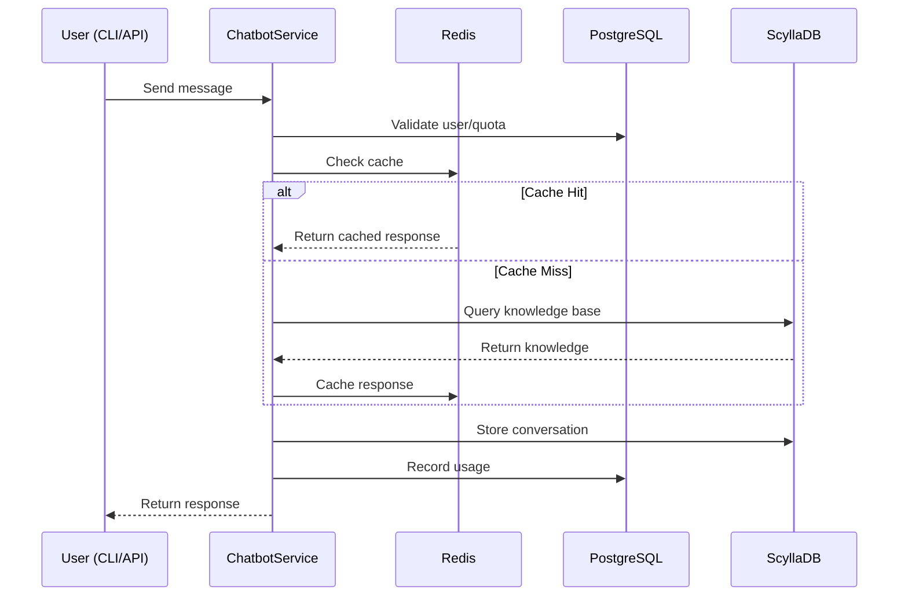
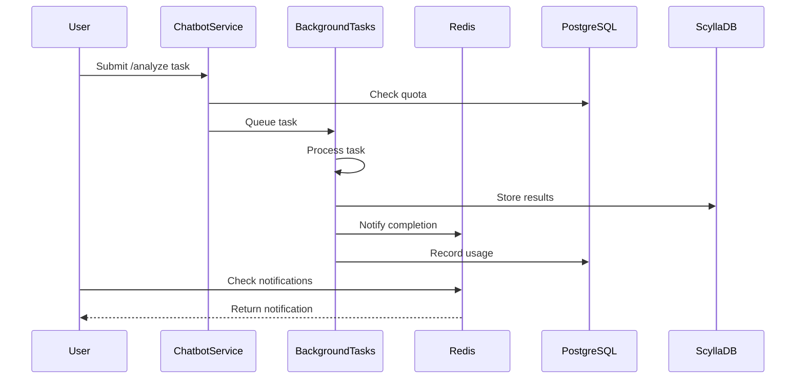
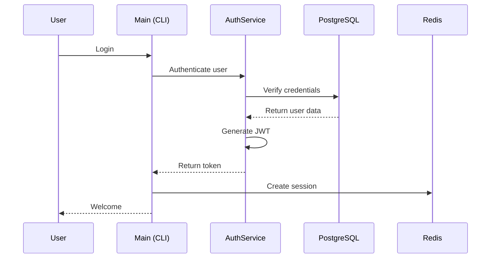

---

# 🏗️ Detail Design Document

## Unified Three-Database Chatbot – System & Data Architecture

This is a complete, ready-to-download markdown file (**includes embedded diagrams and schema/code snippets**).
**You’ll find a download link at the end of this message.**

---


# 🏗️ Detail Design Document: Unified Three-Database Chatbot

## Table of Contents
1. [Introduction](#introduction)
2. [System Architecture](#system-architecture)
3. [Database Architecture & Schemas](#database-architecture--schemas)
   - [Redis](#redis---ultra-fast-operations)
   - [PostgreSQL](#postgresql---business-logic--relationships)
   - [ScyllaDB](#scylladb---high-performance-persistent-storage)
4. [Service & Component Breakdown](#service--component-breakdown)
5. [Data Flow & Orchestration](#data-flow--orchestration)
6. [Configuration & Security](#configuration--security)
7. [Production, DevOps & Deployment](#production-devops--deployment)
8. [Performance & Best Practices](#performance--best-practices)
9. [Appendix: API Surface & Troubleshooting](#appendix-api-surface--troubleshooting)

---

## Introduction

This document provides a comprehensive technical overview and detailed architecture for the Unified Three-Database Chatbot, integrating ScyllaDB, Redis, and PostgreSQL to achieve optimal performance, scalability, and reliability. It is intended for architects, data engineers, and software developers building or maintaining this system.

---

## System Architecture

### High-Level Diagram

```mermaid
flowchart TD
    CLI[CLI Interface]
    API[API Interface - FastAPI]
    ChatbotService[Chatbot Service]
    Redis[Redis]
    PostgreSQL[PostgreSQL]
    ScyllaDB[ScyllaDB]
    CLI & API --> ChatbotService
    ChatbotService --> Redis
    ChatbotService --> PostgreSQL
    ChatbotService --> ScyllaDB
````

### Component Overview

* **CLI & API**: Front-ends for interaction (CLI for local/terminal, API for web/automation)
* **Chatbot Service**: Core orchestrator for message handling, logic, and coordination
* **Databases**:

  * **Redis**: Caching, sessions, analytics, notifications (sub-ms latency)
  * **PostgreSQL**: Auth, billing, quotas, audit logs (strong ACID, relational)
  * **ScyllaDB**: Long-term conversation, knowledge base, feedback (massive scale)

---

## Database Architecture & Schemas

### Responsibilities Table

| Database   | Core Role                                 | Criticality          |
| ---------- | ----------------------------------------- | -------------------- |
| Redis      | Cache, sessions, analytics, notifications | Critical             |
| PostgreSQL | Auth, billing, usage, audit               | Critical             |
| ScyllaDB   | Persistent chat, knowledge base, feedback | Graceful Degradation |

---

### Redis – Ultra-fast Operations

#### Key Structures

* `cache:faq:{hash}`: Cached chatbot responses
* `session:user:{session_id}`: User session data
* `analytics:counter:{metric}`: Real-time metrics
* `notifications:user:{id}`: Notifications for background tasks

#### Example Data

```plaintext
cache:faq:8d2f3b → "Redis is an in-memory data store..."
session:user:2a5... → { "user_id": 1, "last_activity": ... }
```

#### Failure Mode

* No caching (slower), no session persistence, no notifications → **API Unusable**

---

### PostgreSQL – Business Logic & Relationships

#### Core Tables

| Table          | Description             |
| -------------- | ----------------------- |
| users          | User accounts & auth    |
| subscriptions  | Billing plans per user  |
| usage\_records | Track quotas & limits   |
| audit\_logs    | Security and compliance |
| organizations  | Multi-tenant (optional) |

#### Example Schema

```sql
CREATE TABLE users (
    id UUID PRIMARY KEY,
    email VARCHAR(255) UNIQUE NOT NULL,
    password_hash TEXT NOT NULL,
    subscription_plan VARCHAR(50),
    created_at TIMESTAMP,
    is_active BOOLEAN DEFAULT TRUE,
    is_verified BOOLEAN DEFAULT FALSE
);

CREATE TABLE subscriptions (
    id SERIAL PRIMARY KEY,
    user_id UUID REFERENCES users(id),
    plan VARCHAR(50) NOT NULL,
    started_at TIMESTAMP,
    expires_at TIMESTAMP
);

CREATE TABLE usage_records (
    id SERIAL PRIMARY KEY,
    user_id UUID REFERENCES users(id),
    resource_type VARCHAR(50),
    quantity INT,
    billing_period_start TIMESTAMP
);

CREATE TABLE audit_logs (
    id SERIAL PRIMARY KEY,
    user_id UUID,
    action VARCHAR(50),
    ip_address VARCHAR(50),
    timestamp TIMESTAMP
);
```

#### Example Query

```sql
SELECT SUM(quantity) FROM usage_records
WHERE user_id = $1 AND resource_type = 'messages'
  AND billing_period_start >= $2;
```

---

### ScyllaDB – High-Performance Persistent Storage

#### Keyspace/Table Design

* `conversation_history`: (session\_id, ts) → message, actor, confidence
* `knowledge_base`: (keyword) → question, answer, created\_at
* `user_feedback`: (user\_id, ts) → rating, comment

#### Example Schema (CQL)

```cql
CREATE KEYSPACE unified_chatbot_ks
  WITH replication = {'class': 'SimpleStrategy', 'replication_factor': 1};

CREATE TABLE conversation_history (
    session_id UUID,
    ts TIMESTAMP,
    actor TEXT,
    message TEXT,
    confidence DOUBLE,
    PRIMARY KEY (session_id, ts)
);

CREATE TABLE knowledge_base (
    keyword TEXT PRIMARY KEY,
    question TEXT,
    answer TEXT,
    created_at TIMESTAMP
);

CREATE TABLE user_feedback (
    user_id UUID,
    ts TIMESTAMP,
    rating INT,
    comment TEXT,
    PRIMARY KEY (user_id, ts)
);
```

#### Failure Mode

* Chat uses in-memory storage only (no persistence), knowledge base seeded in-memory, **API still works but less persistent**.

---

## Service & Component Breakdown

### Key Services

* **ChatbotService**: Routing, processing, coordination (uses all DBs)
* **AuthService**: Registration, login, JWT management
* **BackgroundTaskService**: Queues/executes long-running analysis/research
* **MultiDatabaseService**: Manages consistency, quota enforcement
* **NotificationService**: Manages Redis notification queue

### Example: Component Responsibility Table

| Service/Class         | Main Responsibility                   | Integrates With             |
| --------------------- | ------------------------------------- | --------------------------- |
| ChatbotService        | Handle all user chat flows            | Redis, ScyllaDB, PostgreSQL |
| AuthService           | Authenticate, register, JWT, sessions | PostgreSQL, Redis           |
| BackgroundTaskService | Analyze, research, notify             | ScyllaDB, Redis             |
| MultiDatabaseService  | Usage/quota, cross-db logic           | All three DBs               |
| NotificationService   | Deliver async notifications           | Redis                       |

---

### Code Snippet Example

**FastAPI endpoint for chat:**

```python
@router.post("/chat/message")
async def send_message(request: ChatRequest, user=Depends(authenticate)):
    # 1. Check quota (PostgreSQL)
    # 2. Check cache (Redis)
    # 3. Query knowledge (ScyllaDB)
    # 4. Update usage (PostgreSQL)
    # 5. Store chat (ScyllaDB)
    # 6. Cache answer (Redis)
    ...
```

---

## Data Flow & Orchestration

### Message Processing Flow



---

### Background Task Processing Flow



---

### Authentication Flow



---

## Configuration & Security

### Sample Configuration

```env
POSTGRES_HOST=localhost
POSTGRES_PORT=5432
POSTGRES_DB=unified_chatbot_db
POSTGRES_USER=chatbot_user
POSTGRES_PASSWORD=secure_password_123

REDIS_HOST=localhost
REDIS_PORT=6379
REDIS_DB=0

SCYLLA_HOST=localhost
SCYLLA_PORT=9042
SCYLLA_KEYSPACE=unified_chatbot_ks

SECRET_KEY=your_secret_key_here
LOG_LEVEL=INFO
```

### Security Practices

* JWT token auth for all endpoints
* Passwords hashed with bcrypt
* Database connections secured with TLS (in production)
* Strict privilege separation between app and DB users
* GDPR and SOC2 compliant audit/logging

---

## Production, DevOps & Deployment

### High-Level Patterns

* **Docker Compose** for local/dev:

  * `docker-compose up -d` launches PostgreSQL, Redis, ScyllaDB, and API
* **Kubernetes** for production:

  * StatefulSets for DBs, HPA for API, secrets/configmaps for sensitive data
* **Cloud** (AWS/GCP/Azure):

  * RDS, ElastiCache, Managed Cassandra/Keyspaces (for Scylla compatibility)

### Health Checks & Monitoring

* `/health` endpoint on API
* DB connection health checks
* Cache hit/miss, background task metrics
* Alerts on resource usage/latency

### Fault Tolerance

* Redis/Postgres: critical; downtime blocks API
* ScyllaDB: optional; falls back to in-memory, API remains functional

---

## Performance & Best Practices

| Operation       | Target Latency | Database   | Optimization    |
| --------------- | -------------- | ---------- | --------------- |
| Cached Response | <10ms          | Redis      | Hash lookup     |
| Knowledge Query | <100ms         | ScyllaDB   | Indexed search  |
| Authentication  | <200ms         | PostgreSQL | Connection pool |
| Task Submission | <500ms         | All        | Async, batched  |

* **Cache hit rate >70%** (monitor via `/stats`)
* **TTL tuning:**

  * Cache: 1hr+, Sessions: 24hr, Analytics: 7d
* **Optimize schema for query patterns**
* **Proactive DB monitoring** (alerts, logs)
* **Document every API & CLI contract**

---

## Appendix: API Surface & Troubleshooting

### Main Endpoints Overview

| Endpoint                  | Method | Description              |
| ------------------------- | ------ | ------------------------ |
| `/auth/register`          | POST   | Register new user        |
| `/auth/login`             | POST   | Login, get JWT           |
| `/auth/me`                | GET    | Get current user info    |
| `/chat/message`           | POST   | Send message, get answer |
| `/chat/history/{session}` | GET    | Get chat history         |
| `/tasks/analyze`          | POST   | Submit analysis task     |
| `/tasks/{id}/status`      | GET    | Check task status        |
| `/tasks/{id}/results`     | GET    | Get analysis results     |
| `/notifications`          | GET    | Fetch notifications      |
| `/analytics/stats`        | GET    | System/user analytics    |

### Troubleshooting

* Check DB container logs (`docker logs ...`)
* Verify `.env` settings
* Use `/health` endpoint to check API state
* Ensure all DBs are reachable
* See user guide for setup and environment tips

---

