# MultiDB Chatbot - Future Implementation Plan & Roadmap

## Executive Summary

This document outlines the comprehensive future development plan for the MultiDB Chatbot system, building upon the current production-ready foundation. The roadmap follows the **Composable AI Stack on AWS** vision, implementing advanced RAG capabilities, multi-agent architectures, and cloud-native deployment.

**Vision**: Transform the current chatbot into a sophisticated **Composable AI Stack** with separate data and serving planes, advanced agent architectures, and production-scale cloud deployment.

---

## Future Architecture Vision

### Target Composable AI Stack Architecture

```mermaid
graph TB
    subgraph "Data Plane - FUTURE IMPLEMENTATION"
        DAGSTER[Dagster Pipeline<br/>🔄 Document Processing<br/>📊 Asset Materialization]
        INGESTION[Document Ingestion<br/>🔄 LangChain Loaders<br/>📄 Multi-format Support]
        CHUNKING[Text Processing<br/>🔄 Smart Chunking<br/>📋 Overlap Management]
        EMBEDDING[Embedding Generation<br/>🔄 Batch Processing<br/>🤖 Stella Model]
        VECTORSTORE[Vector Store<br/>🔄 MongoDB Atlas<br/>🔍 Native Vector Search]
    end
    
    subgraph "Serving Plane - FUTURE IMPLEMENTATION"
        RAY[Ray Serve<br/>🔄 Stateful Agents<br/>⚡ Actor Model]
        AGENT1[Researcher Agent<br/>🔄 Vector Retrieval<br/>📊 Query Processing]
        AGENT2[Synthesizer Agent<br/>🔄 Response Generation<br/>🤖 LLM Integration]
        A2A[Agent-to-Agent<br/>🔄 Communication Protocol<br/>📡 HTTP/gRPC]
    end
    
    subgraph "Control Plane - FUTURE IMPLEMENTATION"
        PREFECT[Prefect Orchestration<br/>🔄 Blue-Green Deployment<br/>🚀 Dynamic Workflows]
        MONITORING[Advanced Monitoring<br/>🔄 Prometheus + Grafana<br/>📊 Custom Metrics]
        CICD[CI/CD Pipeline<br/>🔄 Automated Testing<br/>🚀 Deployment Automation]
    end
    
    subgraph "Cloud Infrastructure - FUTURE IMPLEMENTATION"
        AWS[AWS Cloud Platform<br/>🔄 ECS/EKS<br/>☁️ Auto-scaling]
        ALB[Application Load Balancer<br/>🔄 Traffic Distribution<br/>🛡️ SSL Termination]
        ATLAS[MongoDB Atlas<br/>🔄 Production Vector Search<br/>🌐 Global Clusters]
    end
    
    DAGSTER --> INGESTION
    INGESTION --> CHUNKING
    CHUNKING --> EMBEDDING
    EMBEDDING --> VECTORSTORE
    
    RAY --> AGENT1
    RAY --> AGENT2
    AGENT1 --> A2A
    A2A --> AGENT2
    
    PREFECT --> DAGSTER
    PREFECT --> RAY
    
    AWS --> ALB
    ALB --> RAY
    AWS --> ATLAS
    
    style DAGSTER fill:#ffe5cc
    style RAY fill:#ffe5cc
    style PREFECT fill:#ffe5cc
    style AWS fill:#ffe5cc
```



---

## Phase 1: RAG Pipeline Implementation (Weeks 1-2)

### 1.1 Dagster Data Plane Setup

**Timeline**: Days 1-5 of 2-week plan
**Status**: 🔄 **Next Implementation Priority**

#### Dagster Project Structure
```
multidb_chatbot/
├── dagster_project/
│   ├── __init__.py
│   ├── assets/
│   │   ├── document_ingestion.py      # 🔄 TO IMPLEMENT
│   │   ├── text_processing.py         # 🔄 TO IMPLEMENT  
│   │   ├── embedding_generation.py    # 🔄 TO IMPLEMENT
│   │   └── vector_materialization.py  # 🔄 TO IMPLEMENT
│   ├── resources/
│   │   ├── mongo_resource.py          # 🔄 TO IMPLEMENT
│   │   ├── stella_resource.py         # 🔄 TO IMPLEMENT
│   │   └── storage_resource.py        # 🔄 TO IMPLEMENT
│   ├── sensors/
│   │   └── document_sensor.py         # 🔄 TO IMPLEMENT
│   ├── schedules/
│   │   └── maintenance_schedule.py    # 🔄 TO IMPLEMENT
│   └── dagster_project.py             # 🔄 TO IMPLEMENT
```

#### Asset Implementation Plan

**Document Ingestion Asset**:
```python
# 🔄 TO IMPLEMENT - assets/document_ingestion.py
@asset
def source_documents(config: DocumentIngestionConfig) -> List[Dict[str, Any]]:
    """
    Asset 1: Discover and validate source documents.
    Integration: File system, URLs, APIs, Git repositories
    Output: List of document metadata for processing
    """
    # Implementation Plan:
    # 1. Support multiple sources (local files, URLs, S3, Git repos)
    # 2. File type validation (PDF, MD, TXT, DOCX, HTML)
    # 3. Size and format validation
    # 4. Metadata extraction and cataloging
    
@asset
def extracted_documents(source_documents) -> List[Dict[str, Any]]:
    """
    Asset 2: Extract text content from documents.
    Integration: LangChain document loaders
    Output: Documents with extracted text content
    """
    # Implementation Plan:
    # 1. Use LangChain loaders (PyPDFLoader, UnstructuredMarkdownLoader)
    # 2. OCR integration for image-based PDFs
    # 3. Error handling and retry logic
    # 4. Content quality assessment
```

**Text Processing Asset**:
```python
# 🔄 TO IMPLEMENT - assets/text_processing.py
@asset
def document_chunks(extracted_documents) -> List[Dict[str, Any]]:
    """
    Asset 3: Split documents into optimized chunks.
    Integration: LangChain text splitters with advanced strategies
    Output: Document chunks ready for embedding
    """
    # Implementation Plan:
    # 1. Semantic chunking based on document structure
    # 2. Adaptive chunk sizes based on content type
    # 3. Overlap optimization for context preservation
    # 4. Metadata propagation and chunk indexing
```

**Embedding Generation Asset**:
```python
# 🔄 TO IMPLEMENT - assets/embedding_generation.py
@asset
def document_embeddings(document_chunks, stella_model) -> List[Dict[str, Any]]:
    """
    Asset 4: Generate embeddings for document chunks.
    Integration: Current Stella model implementation
    Output: Chunks with 1024-dimensional embeddings
    """
    # Implementation Plan:
    # 1. Batch processing for efficiency
    # 2. GPU acceleration where available
    # 3. Embedding caching and deduplication
    # 4. Quality validation and scoring
```

**Vector Store Materialization**:
```python
# 🔄 TO IMPLEMENT - assets/vector_materialization.py
@asset
def materialized_vector_store(document_embeddings) -> Dict[str, Any]:
    """
    Asset 5: Store embeddings in MongoDB with optimization.
    Integration: Current MongoDB manager
    Output: Storage confirmation and statistics
    """
    # Implementation Plan:
    # 1. Bulk insertion optimization
    # 2. Index management and optimization
    # 3. Data versioning and rollback capability
    # 4. Performance monitoring and alerting
```

### 1.2 MongoDB Atlas Vector Search Migration

**Timeline**: Days 2-4 of 2-week plan
**Status**: 🔄 **High Priority**

#### Atlas Setup Configuration
```python
# 🔄 TO IMPLEMENT - Enhanced mongo_connection.py
class AtlasVectorSearchManager:
    """
    Production MongoDB Atlas integration for vector search.
    Extends current MongoDBManager with Atlas-specific features.
    """
    
    def __init__(self):
        self.atlas_uri = os.getenv("MONGO_ATLAS_URI")
        self.vector_index_config = {
            "name": "vector_index",
            "definition": {
                "fields": [{
                    "type": "vector",
                    "path": "embedding", 
                    "numDimensions": 1024,
                    "similarity": "cosine"
                }, {
                    "type": "filter",
                    "path": "category"
                }, {
                    "type": "filter",
                    "path": "document_type"
                }]
            }
        }
    
    async def create_vector_search_index(self):
        """Create Atlas Vector Search index for production performance"""
        # Implementation Plan:
        # 1. Atlas cluster configuration (M10+ for vector search)
        # 2. Vector search index creation
        # 3. Performance tuning and optimization
        # 4. Monitoring and alerting setup
    
    async def atlas_vector_search(self, query_embedding, filters=None, limit=10):
        """
        Production vector search using Atlas native indexing.
        Replaces manual cosine similarity with optimized Atlas search.
        """
        # Implementation Plan:
        # 1. Native $vectorSearch aggregation pipeline
        # 2. Hybrid search combining vector + text search
        # 3. Result ranking and score fusion
        # 4. Performance optimization and caching
```

### 1.3 RAG Service Enhancement

**Timeline**: Days 6-8 of 2-week plan
**Status**: 🔄 **Medium Priority**

#### Enhanced ChatbotService for RAG
```python
# 🔄 TO IMPLEMENT - Enhanced services/rag_service.py
class ProductionRAGService(ChatbotService):
    """
    Production RAG service with advanced retrieval and generation.
    Extends current ChatbotService with full RAG capabilities.
    """
    
    async def process_rag_query(self, session_id: str, user_message: str, 
                               user_context: dict = None) -> ChatResponse:
        """
        Full RAG pipeline: Retrieve → Generate → Respond
        """
        # Implementation Plan:
        # 1. Query preprocessing and expansion
        # 2. Multi-stage retrieval (vector + keyword + reranking)
        # 3. Context window management
        # 4. LLM integration for response generation
        # 5. Citation and source attribution
        # 6. Response quality assessment
    
    async def hybrid_retrieval(self, query: str, filters: dict = None) -> List[Document]:
        """
        Advanced retrieval combining multiple search strategies.
        """
        # Implementation Plan:
        # 1. Dense retrieval (vector search)
        # 2. Sparse retrieval (keyword/BM25)
        # 3. Reranking with cross-encoder models
        # 4. Result fusion and deduplication
        # 5. Contextual filtering and relevance scoring
```

---

## Phase 2: Multi-Agent Architecture (Weeks 3-4)

### 2.1 Ray Serve Implementation

**Timeline**: Week 3
**Status**: 🔄 **Future Implementation**

#### Ray Serve Architecture
```python
# 🔄 TO IMPLEMENT - services/ray_serve_manager.py
from ray import serve
import ray

@serve.deployment
class ResearcherAgent:
    """
    Specialized agent for document retrieval and research.
    Stateful Ray Serve deployment for vector search operations.
    """
    
    def __init__(self):
        # Implementation Plan:
        # 1. MongoDB Atlas connection for vector search
        # 2. Query processing and optimization
        # 3. Result ranking and filtering
        # 4. Performance monitoring and logging
    
    async def research_query(self, query: dict) -> dict:
        """
        Process research queries with specialized retrieval.
        """
        # Implementation Plan:
        # 1. Query understanding and expansion
        # 2. Multi-modal search (text, code, documents)
        # 3. Source validation and quality scoring
        # 4. Comprehensive result compilation

@serve.deployment  
class SynthesizerAgent:
    """
    Agent for response synthesis and user interaction.
    Handles conversation management and response generation.
    """
    
    def __init__(self):
        # Implementation Plan:
        # 1. Conversation state management
        # 2. LLM integration (OpenAI, Anthropic, or local models)
        # 3. Response quality control
        # 4. User preference adaptation
    
    async def synthesize_response(self, context: dict, user_query: str) -> dict:
        """
        Generate contextual responses using retrieved information.
        """
        # Implementation Plan:
        # 1. Context integration and filtering
        # 2. Prompt engineering and optimization
        # 3. Response generation with multiple strategies
        # 4. Quality assessment and validation
```

### 2.2 Agent-to-Agent Communication

**Timeline**: Week 3-4
**Status**: 🔄 **Future Implementation**

#### A2A Communication Protocol
```python
# 🔄 TO IMPLEMENT - services/agent_communication.py
class AgentCommunicationProtocol:
    """
    Protocol for secure and efficient agent-to-agent communication.
    """
    
    def __init__(self):
        # Implementation Plan:
        # 1. HTTP/gRPC protocol definition
        # 2. Message serialization and validation
        # 3. Authentication and authorization
        # 4. Error handling and retry logic
        # 5. Performance monitoring and tracing
    
    async def researcher_tool_call(self, query: str, filters: dict = None) -> dict:
        """
        Tool interface for Synthesizer to call Researcher agent.
        """
        # Implementation Plan:
        # 1. Request routing and load balancing
        # 2. Circuit breaker for fault tolerance
        # 3. Response caching and optimization
        # 4. Distributed tracing for debugging

    async def workflow_orchestration(self, user_request: dict) -> dict:
        """
        Orchestrate multi-agent workflows for complex queries.
        """
        # Implementation Plan:
        # 1. Workflow definition and execution
        # 2. State management across agents
        # 3. Error recovery and compensation
        # 4. Performance optimization and scaling
```

---

## Phase 3: LLM Integration & Advanced Generation

### 3.1 Large Language Model Integration

**Timeline**: Month 2
**Status**: 🔄 **Future Implementation**

#### LLM Service Architecture
```python
# 🔄 TO IMPLEMENT - services/llm_service.py
class LLMService:
    """
    Service for integrating multiple LLM providers and local models.
    """
    
    def __init__(self):
        # Implementation Plan:
        # 1. Multi-provider support (OpenAI, Anthropic, Cohere)
        # 2. Local model integration (Llama 3, DeepSeek)
        # 3. Model routing and fallback strategies
        # 4. Cost optimization and budget management
        # 5. Performance monitoring and latency tracking
    
    async def generate_response(self, prompt: str, context: List[str], 
                               model_preferences: dict = None) -> dict:
        """
        Generate responses using appropriate LLM based on query type.
        """
        # Implementation Plan:
        # 1. Model selection based on query complexity
        # 2. Context window optimization
        # 3. Prompt engineering and templates
        # 4. Response quality validation
        # 5. Cost tracking and optimization

class LocalLLMManager:
    """
    Manager for local LLM deployment and inference.
    """
    
    def __init__(self):
        # Implementation Plan:
        # 1. Model quantization and optimization
        # 2. GPU memory management
        # 3. Batch inference optimization
        # 4. Model serving with vLLM or similar
        # 5. Performance monitoring and scaling
```

### 3.2 Advanced Prompt Engineering

**Timeline**: Month 2
**Status**: 🔄 **Future Implementation**

#### Prompt Management System
```python
# 🔄 TO IMPLEMENT - services/prompt_service.py
class PromptManagementService:
    """
    Advanced prompt engineering and management system.
    """
    
    def __init__(self):
        # Implementation Plan:
        # 1. Prompt template management
        # 2. Dynamic prompt generation
        # 3. A/B testing for prompt effectiveness
        # 4. Context-aware prompt selection
        # 5. Performance analytics and optimization
    
    async def generate_contextual_prompt(self, query: str, context: List[dict], 
                                        user_profile: dict = None) -> str:
        """
        Generate optimized prompts based on query type and context.
        """
        # Implementation Plan:
        # 1. Query classification and intent detection
        # 2. Context relevance scoring and filtering
        # 3. User personalization and preference integration
        # 4. Prompt optimization based on model capabilities
        # 5. Response quality feedback loop
```

---

## Phase 4: Cloud Infrastructure & Deployment

### 4.1 AWS Cloud Architecture

**Timeline**: Month 3
**Status**: 🔄 **Future Implementation**

#### Infrastructure as Code
```yaml
# 🔄 TO IMPLEMENT - infrastructure/terraform/
# Complete AWS infrastructure definition

# ECS/EKS Cluster Configuration
resource "aws_ecs_cluster" "multidb_chatbot" {
  name = "multidb-chatbot-cluster"
  
  setting {
    name  = "containerInsights"
    value = "enabled"
  }
  
  capacity_providers = ["FARGATE", "FARGATE_SPOT"]
  
  default_capacity_provider_strategy {
    capacity_provider = "FARGATE"
    weight           = 100
  }
}

# Application Load Balancer
resource "aws_lb" "multidb_chatbot_alb" {
  name               = "multidb-chatbot-alb"
  internal           = false
  load_balancer_type = "application"
  security_groups    = [aws_security_group.alb.id]
  subnets           = aws_subnet.public[*].id
  
  enable_deletion_protection = true
  
  tags = {
    Environment = "production"
    Project     = "multidb-chatbot"
  }
}

# Auto Scaling Configuration
resource "aws_appautoscaling_target" "multidb_chatbot_target" {
  max_capacity       = 10
  min_capacity       = 2
  resource_id        = "service/${aws_ecs_cluster.multidb_chatbot.name}/${aws_ecs_service.multidb_chatbot.name}"
  scalable_dimension = "ecs:service:DesiredCount"
  service_namespace  = "ecs"
}
```

#### Container Orchestration
```yaml
# 🔄 TO IMPLEMENT - k8s/production/
# Kubernetes deployment manifests

apiVersion: apps/v1
kind: Deployment
metadata:
  name: multidb-chatbot-api
spec:
  replicas: 3
  selector:
    matchLabels:
      app: multidb-chatbot-api
  template:
    metadata:
      labels:
        app: multidb-chatbot-api
    spec:
      containers:
      - name: chatbot-api
        image: multidb-chatbot:latest
        ports:
        - containerPort: 8000
        env:
        - name: MONGO_ATLAS_URI
          valueFrom:
            secretKeyRef:
              name: mongodb-secret
              key: atlas-uri
        resources:
          requests:
            memory: "2Gi"
            cpu: "1"
          limits:
            memory: "4Gi" 
            cpu: "2"
        livenessProbe:
          httpGet:
            path: /health
            port: 8000
          initialDelaySeconds: 30
          periodSeconds: 10
```

### 4.2 Advanced Monitoring & Observability

**Timeline**: Month 3
**Status**: 🔄 **Future Implementation**

#### Prometheus + Grafana Setup
```python
# 🔄 TO IMPLEMENT - monitoring/metrics.py
class AdvancedMetricsCollector:
    """
    Comprehensive metrics collection for production monitoring.
    """
    
    def __init__(self):
        # Implementation Plan:
        # 1. Custom Prometheus metrics
        # 2. Application performance monitoring
        # 3. Business logic metrics
        # 4. AI/ML model performance tracking
        # 5. User experience metrics
    
    async def collect_rag_metrics(self, query: str, context: List[str], 
                                 response: str, latency: float):
        """
        Collect RAG-specific metrics for optimization.
        """
        # Implementation Plan:
        # 1. Retrieval quality metrics
        # 2. Generation quality scores
        # 3. User satisfaction tracking
        # 4. Performance bottleneck identification
        # 5. A/B testing metrics

    async def collect_agent_metrics(self, agent_name: str, operation: str, 
                                   performance_data: dict):
        """
        Collect agent-specific performance metrics.
        """
        # Implementation Plan:
        # 1. Agent response times
        # 2. Communication latency
        # 3. Resource utilization
        # 4. Error rates and patterns
        # 5. Load balancing effectiveness
```

#### Custom Dashboards
```yaml
# 🔄 TO IMPLEMENT - monitoring/dashboards/
# Grafana dashboard configurations

multidb_chatbot_dashboard:
  title: "MultiDB Chatbot - Production Monitoring"
  panels:
    - name: "RAG Performance"
      metrics:
        - retrieval_latency_p95
        - generation_quality_score
        - user_satisfaction_rating
        - context_relevance_score
    
    - name: "Agent Performance" 
      metrics:
        - agent_response_time
        - agent_communication_latency
        - agent_error_rate
        - agent_throughput
    
    - name: "Infrastructure Health"
      metrics:
        - database_connection_pool_usage
        - memory_utilization
        - cpu_utilization
        - network_io
```

---

## Phase 5: Advanced Control Plane

### 5.1 Prefect Orchestration

**Timeline**: Month 4
**Status**: 🔄 **Future Implementation**

#### Blue-Green Deployment Workflow
```python
# 🔄 TO IMPLEMENT - workflows/prefect_flows.py
from prefect import flow, task
import asyncio

@flow(name="blue-green-deployment")
async def blue_green_deployment_flow(
    new_model_version: str,
    deployment_environment: str = "production"
):
    """
    Automated blue-green deployment workflow for model updates.
    """
    
    # Implementation Plan:
    # 1. Provision blue environment
    # 2. Deploy new model version
    # 3. Run validation suite
    # 4. Gradual traffic shifting
    # 5. Monitoring and rollback capability
    
    @task
    async def provision_blue_environment():
        """Provision new environment for deployment"""
        # 1. Create new ECS service definition
        # 2. Deploy containers with new model
        # 3. Configure health checks
        # 4. Validate service readiness
    
    @task  
    async def validate_deployment():
        """Comprehensive validation of new deployment"""
        # 1. Functional testing
        # 2. Performance benchmarking  
        # 3. A/B testing setup
        # 4. Quality assurance checks
    
    @task
    async def shift_traffic(percentage: int):
        """Gradually shift traffic to new deployment"""
        # 1. Update load balancer weights
        # 2. Monitor performance metrics
        # 3. Validate user experience
        # 4. Rollback if issues detected

@flow(name="model-retraining-pipeline") 
async def model_retraining_flow():
    """
    Automated model retraining and deployment pipeline.
    """
    # Implementation Plan:
    # 1. Data collection and validation
    # 2. Model training and evaluation
    # 3. Performance comparison
    # 4. Automated deployment approval
    # 5. Monitoring and feedback collection
```

### 5.2 Advanced CI/CD Pipeline

**Timeline**: Month 4  
**Status**: 🔄 **Future Implementation**

#### GitHub Actions Workflow
```yaml
# 🔄 TO IMPLEMENT - .github/workflows/production-deploy.yml
name: Production Deployment Pipeline

on:
  push:
    branches: [main]
  pull_request:
    branches: [main]

jobs:
  test:
    runs-on: ubuntu-latest
    strategy:
      matrix:
        python-version: [3.11, 3.12]
    
    services:
      postgres:
        image: postgres:15
        env:
          POSTGRES_PASSWORD: postgres
        options: >-
          --health-cmd pg_isready
          --health-interval 10s
          --health-timeout 5s
          --health-retries 5
      
      redis:
        image: redis:7
        options: >-
          --health-cmd "redis-cli ping"
          --health-interval 10s
          --health-timeout 5s
          --health-retries 5
      
      mongodb:
        image: mongo:latest
        env:
          MONGO_INITDB_ROOT_USERNAME: root
          MONGO_INITDB_ROOT_PASSWORD: example
    
    steps:
    - uses: actions/checkout@v3
    
    - name: Set up Python
      uses: actions/setup-python@v4
      with:
        python-version: ${{ matrix.python-version }}
    
    - name: Install dependencies
      run: |
        pip install -r requirements.txt
        pip install -r requirements-dev.txt
    
    - name: Run comprehensive tests
      run: |
        pytest tests/ -v --cov=app --cov-report=xml
        python scripts/test_mongo_connection.py
        python scripts/test_vector_search.py
        python scripts/test_notifications.py
    
    - name: Security scanning
      run: |
        bandit -r app/
        safety check
    
    - name: Code quality checks
      run: |
        flake8 app/
        mypy app/
        black --check app/

  deploy-staging:
    needs: test
    runs-on: ubuntu-latest
    if: github.ref == 'refs/heads/main'
    
    steps:
    - name: Deploy to staging
      run: |
        # Automated staging deployment
        # Integration testing
        # Performance validation

  deploy-production:
    needs: deploy-staging
    runs-on: ubuntu-latest
    if: github.ref == 'refs/heads/main'
    environment: production
    
    steps:
    - name: Blue-green deployment
      run: |
        # Trigger Prefect blue-green workflow
        # Monitor deployment health
        # Validate production readiness
```

---

## Phase 6: Advanced Features & Optimization

### 6.1 Multi-Modal Capabilities

**Timeline**: Month 5-6
**Status**: 🔄 **Future Enhancement**

#### Multi-Modal Processing
```python
# 🔄 TO IMPLEMENT - services/multimodal_service.py
class MultiModalProcessingService:
    """
    Service for processing multiple data modalities.
    """
    
    def __init__(self):
        # Implementation Plan:
        # 1. Image processing and OCR
        # 2. Audio transcription and analysis
        # 3. Video content extraction
        # 4. Code analysis and understanding
        # 5. Structured data processing
    
    async def process_document_with_images(self, document_path: str) -> dict:
        """
        Process documents containing text, images, and diagrams.
        """
        # Implementation Plan:
        # 1. Text extraction from mixed content
        # 2. Image description and analysis
        # 3. Diagram interpretation
        # 4. Layout-aware chunking
        # 5. Multi-modal embedding generation

    async def code_understanding(self, code_content: str, language: str) -> dict:
        """
        Advanced code analysis and documentation generation.
        """
        # Implementation Plan:
        # 1. AST parsing and analysis
        # 2. Code semantic understanding
        # 3. Documentation generation
        # 4. Bug detection and suggestions
        # 5. Code similarity search
```

### 6.2 Advanced Personalization

**Timeline**: Month 6
**Status**: 🔄 **Future Enhancement**

#### User Modeling and Personalization
```python
# 🔄 TO IMPLEMENT - services/personalization_service.py
class PersonalizationService:
    """
    Advanced user modeling and personalization engine.
    """
    
    def __init__(self):
        # Implementation Plan:
        # 1. User behavior analysis
        # 2. Preference learning and adaptation
        # 3. Content recommendation
        # 4. Response style adaptation
        # 5. Learning path optimization
    
    async def build_user_profile(self, user_id: str, interaction_history: List[dict]) -> dict:
        """
        Build comprehensive user profiles for personalization.
        """
        # Implementation Plan:
        # 1. Skill level assessment
        # 2. Interest categorization
        # 3. Learning style identification
        # 4. Preferred response formats
        # 5. Domain expertise mapping

    async def personalize_response(self, response: str, user_profile: dict) -> str:
        """
        Adapt responses based on user preferences and expertise.
        """
        # Implementation Plan:
        # 1. Technical level adjustment
        # 2. Format preference adaptation
        # 3. Cultural and language preferences
        # 4. Learning objective alignment
        # 5. Accessibility considerations
```

---

## Phase 7: Enterprise Features & Scaling

### 7.1 Multi-Tenant Architecture

**Timeline**: Month 7-8
**Status**: 🔄 **Future Enhancement**

#### Tenant Isolation and Management
```python
# 🔄 TO IMPLEMENT - services/tenant_service.py
class TenantManagementService:
    """
    Multi-tenant architecture for enterprise deployment.
    """
    
    def __init__(self):
        # Implementation Plan:
        # 1. Tenant isolation and security
        # 2. Resource allocation and quotas
        # 3. Custom model fine-tuning per tenant
        # 4. Tenant-specific configuration
        # 5. Billing and usage tracking
    
    async def provision_tenant(self, tenant_config: dict) -> dict:
        """
        Provision new tenant with isolated resources.
        """
        # Implementation Plan:
        # 1. Database schema isolation
        # 2. Vector store partitioning
        # 3. Model deployment per tenant
        # 4. Security boundary establishment
        # 5. Monitoring and alerting setup

    async def tenant_model_training(self, tenant_id: str, training_data: dict) -> str:
        """
        Fine-tune models for specific tenant requirements.
        """
        # Implementation Plan:
        # 1. Domain-specific model fine-tuning
        # 2. Tenant data isolation during training
        # 3. Model performance validation
        # 4. Deployment and rollback procedures
        # 5. Performance monitoring and optimization
```

### 7.2 Advanced Analytics & Insights

**Timeline**: Month 8
**Status**: 🔄 **Future Enhancement**

#### Business Intelligence and Analytics
```python
# 🔄 TO IMPLEMENT - services/analytics_service.py
class AdvancedAnalyticsService:
    """
    Comprehensive analytics and business intelligence.
    """
    
    def __init__(self):
        # Implementation Plan:
        # 1. Real-time analytics dashboard
        # 2. Usage pattern analysis
        # 3. Performance optimization insights
        # 4. User behavior analytics
        # 5. Business impact measurement
    
    async def generate_usage_insights(self, tenant_id: str, time_period: str) -> dict:
        """
        Generate comprehensive usage and performance insights.
        """
        # Implementation Plan:
        # 1. Query pattern analysis
        # 2. Performance bottleneck identification
        # 3. User satisfaction metrics
        # 4. Cost optimization recommendations
        # 5. Capacity planning insights

    async def model_performance_analytics(self, model_id: str) -> dict:
        """
        Detailed model performance analysis and optimization.
        """
        # Implementation Plan:
        # 1. Accuracy and quality metrics
        # 2. Latency and throughput analysis
        # 3. Resource utilization optimization
        # 4. A/B testing results
        # 5. Continuous improvement recommendations
```

---

## Integration Timeline & Milestones

### Development Roadmap


### Key Milestones & Success Criteria

#### Phase 1 Success Criteria (Weeks 1-2)
- ✅ Dagster pipeline processing 1000+ documents/hour
- ✅ MongoDB Atlas vector search with <100ms latency
- ✅ RAG responses with 85%+ user satisfaction
- ✅ End-to-end document ingestion pipeline
- ✅ Production monitoring and alerting

#### Phase 2 Success Criteria (Weeks 3-4)  
- ✅ Multi-agent system with <200ms A2A communication
- ✅ Stateful conversation management
- ✅ Agent specialization and load balancing
- ✅ Fault tolerance and error recovery
- ✅ Performance monitoring for agent interactions

#### Long-term Success Criteria (6+ months)
- ✅ Horizontal scaling to 10,000+ concurrent users
- ✅ Multi-tenant architecture supporting 100+ organizations
- ✅ 99.9% uptime with blue-green deployments
- ✅ Advanced analytics and business intelligence
- ✅ Enterprise-grade security and compliance

---

## Risk Assessment & Mitigation

### Technical Risks

| Risk | Impact | Probability | Mitigation Strategy |
|------|--------|-------------|-------------------|
| **Stella Model Performance** | High | Medium | • GPU optimization<br/>• Model quantization<br/>• Fallback to smaller models |
| **MongoDB Atlas Costs** | Medium | High | • Usage monitoring<br/>• Query optimization<br/>• Hybrid search strategies |
| **Ray Serve Complexity** | High | Medium | • Incremental implementation<br/>• Thorough testing<br/>• Fallback to current system |
| **LLM Integration Costs** | High | High | • Cost monitoring<br/>• Multiple provider fallbacks<br/>• Local model alternatives |
| **Multi-Agent Coordination** | Medium | Medium | • Simple protocols first<br/>• Extensive testing<br/>• Circuit breakers |

### Operational Risks

| Risk | Impact | Probability | Mitigation Strategy |
|------|--------|-------------|-------------------|
| **Cloud Migration Complexity** | High | Medium | • Staged migration<br/>• Parallel running<br/>• Rollback procedures |
| **Scaling Challenges** | Medium | High | • Load testing<br/>• Auto-scaling<br/>• Performance monitoring |
| **Data Privacy & Security** | High | Low | • Encryption at rest/transit<br/>• Access controls<br/>• Audit logging |
| **Vendor Lock-in** | Medium | Medium | • Multi-provider strategy<br/>• Open source alternatives<br/>• Data portability |

---

## Resource Requirements & Estimates

### Development Resources

#### Team Composition (Future)
- **Senior ML Engineer**: RAG pipeline, vector search optimization
- **Cloud Infrastructure Engineer**: AWS deployment, monitoring
- **Backend Developer**: API development, database optimization  
- **DevOps Engineer**: CI/CD, container orchestration
- **QA Engineer**: Testing, validation, performance

#### Technology Investments
- **MongoDB Atlas**: $500-2000/month (based on usage)
- **AWS Infrastructure**: $1000-5000/month (auto-scaling)
- **LLM API Costs**: $200-1000/month (based on usage)
- **Monitoring Tools**: $200-500/month (Datadog, New Relic)
- **Development Tools**: $300-800/month (CI/CD, testing)

### Infrastructure Scaling Estimates

#### Performance Targets
- **Concurrent Users**: 1,000 → 10,000 → 100,000
- **Query Latency**: <100ms (vector search) → <50ms (optimized)
- **Throughput**: 1,000 queries/hour → 100,000 queries/hour
- **Uptime**: 99.9% → 99.99% with blue-green deployments

---

## Conclusion

The future implementation plan builds upon the current **production-ready foundation** to create a sophisticated **Composable AI Stack** capable of enterprise-scale deployment. The phased approach ensures:

1. **Incremental Value Delivery**: Each phase provides immediate business value
2. **Risk Mitigation**: Staged implementation with fallback strategies  
3. **Scalability**: Architecture designed for horizontal scaling
4. **Flexibility**: Modular design allowing component swapping
5. **Production Readiness**: Enterprise-grade monitoring and deployment

**Next Immediate Priority**: Begin Phase 1 RAG pipeline implementation, leveraging the current vector search foundation and MongoDB integration.

The roadmap transforms the current system from a sophisticated chatbot into a **production-scale Composable AI platform** ready for enterprise deployment and advanced AI agent architectures.